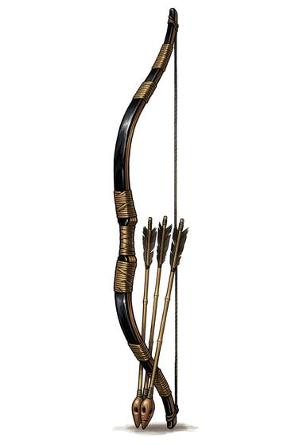

# Asymmetric Longbow

{.illus}

*Set: Expansion*

*aka: ______________________________*

*Era: Iron (needs iron) · Island warrior houses · Retainer's code*

A bow taller than its archer, made from strips of wood and bamboo glued together and wrapped in cord and lacquer, and held not at the middle but well below it. The short lower limb lets it be drawn from a kneeling position or from the back of a horse, and the long upper limb gives it a slow, heavy cast. Its arrows are long, fletched with care and often whistle in flight.

For the island warrior houses it was the first weapon of rank, older than the famous swords. Archery was taught as a discipline of posture and breath as much as of aim, and a retainer was judged by how calmly he drew. Loosed from the saddle, it lets a mounted archer shoot, turn and shoot again.

## Game block

- **Group:** [Bows](../Weapon_Groups/bows.md) · **Damage:** 1d6+2· **Strength number:** 12
- **Hands:** two · **Range (m):** 5/30/60/100/200 · **Reload:** every round · **Weight:** 1 kg · **Price:** 40 S
- **Notes:** gripped below the middle
- **Techniques (from the group):** Rapid Volley, Arcing Shot, Shot on the Move

## Not to be confused with

the *[Longbow](longbow.md)*, a plain self-bow of one stave, held in the middle and loosed in massed volleys rather than from horseback.

