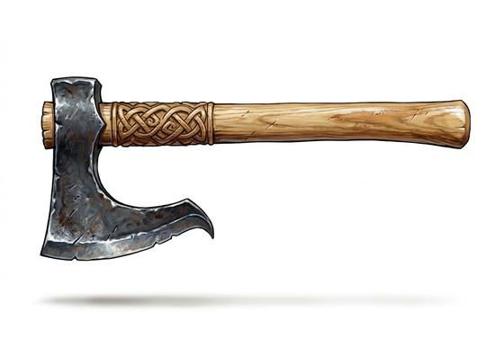

# Bearded Axe

{.illus}

*Set: Core*

*aka: ______________________________*

*Era: Iron (needs iron) · Northern tribes · Raiding and shield wall*

A light, single-handed axe whose blade hangs down below the haft in a long, curving lower edge, the beard. It is equally at home splitting logs by the fire and splitting heads on a raid. Northern warriors, farmers and sailors carry it, often alongside a shield and a knife.

The beard is the clever part. A warrior can hook it over the rim of a shield and wrench it down, exposing the man behind to a second blow. The long edge also cuts well, and the hand can grip right under the head for fine work. It is cheap enough to buy with a season's surplus, which is why it appears in so many graves.

## Game block

- **Group:** [Axes, Maces & Clubs](../Weapon_Groups/axes-maces-and-clubs.md) · **Damage:** 1d6+2· **Strength number:** 11
- **Hands:** one · **Weight:** 1.3 kg · **Price:** 12 S
- **Notes:** the hooked beard pulls shields down
- **Techniques (from the group):** Hook the Shield, Bone-Breaker

## Not to be confused with

the *[Dane Axe](dane-axe.md)*, the northern two-handed axe on a long haft: it hits harder, but there's no shield.

