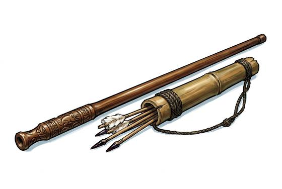

# Blowgun

{.illus}

*Set: Core*

*aka: ______________________________*

*Era: Stone and fire (—) · Hunter peoples · Hunting and skirmish*

A long, straight tube of hollow cane or bored wood, through which a hunter puffs a slender dart. It makes almost no sound. A bird on a high branch falls, and the rest of the flock doesn't even look up. Forest hunters use it where bows would snag on vines and a shout would empty the trees.

The dart itself is barely a splinter and would hardly trouble a mouse. What it carries is the point: a smear of poison, carefully prepared from frogs, plants or roots, that stills birds, monkeys and, in a darker use, people. Without that coating, the blowgun is a toy. With it, it is one of the quietest killers there is.

## Game block

- **Group:** [Blowguns](../Weapon_Groups/blowguns.md) · **Damage:** 1, plus the dart's poison· **Strength number:** 4
- **Hands:** two · **Range (m):** 2/8/15/20/30 · **Reload:** every round · **Weight:** 0.5 kg · **Price:** 2 S
- **Notes:** harmless without poison; the dart carries it
- **Techniques (from the group):** Silent Dart, Find Bare Skin

## Not to be confused with

the *[Needle Gun](needle-gun.md)*, a far later weapon that fires darts with compressed gas or electricity instead of the hunter's breath.

