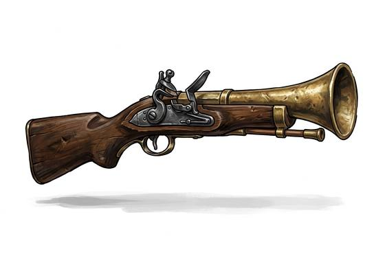

# Blunderbuss

{.illus}

*Set: Expansion*

*aka: ______________________________*

*Era: Gunpowder (needs gunpowder) · Pike-and-shot armies*

A short gun with a wide, flared mouth like a trumpet, loaded with a handful of lead shot, nails, stones or whatever else will fit. It doesn't aim so much as point. The flare spreads the load and makes it easier to pour in on a pitching deck or a bouncing coach, and the roar and spray at close quarters clear a doorway or a gangway in one terrible moment.

Coach guards, ships' crews and householders guarding their strongrooms all favour it, because it rewards nerve more than skill. Beyond a few paces the shot scatters uselessly and the weapon is barely worth carrying. Up close there are few things more persuasive. Its look alone often does the job: the flared mouth staring at you makes a point.

## Game block

- **Group:** [Black-Powder Guns](../Weapon_Groups/black-powder-guns.md) · **Damage:** 2d6· **Strength number:** 9
- **Hands:** two · **Range (m):** 2/5/10/15/20 · **Reload:** 4 rounds · **Weight:** 4 kg · **Price:** 15 G
- **Notes:** a spray of shot; +3 to hit at point blank and short
- **Techniques (from the group):** Drilled Reload, Point-Blank Discharge

## Not to be confused with

the *[Double-Barrel Shotgun](double-barrel-shotgun.md)*, a later breech-loading scatter-gun with two quick shots and far better reach.

