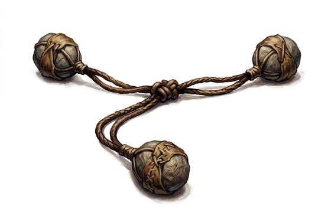

# Bola

{.illus}

*Set: Core*

*aka: ______________________________*

*Era: Stone and fire (—) · Hunter peoples · Hunting and skirmish*

Two or three heavy stones or weights, each wrapped in hide, tied to the ends of cords that join at a single knot. The thrower whirls it overhead and lets it fly; it spins through the air like a spider and wraps around whatever it hits. Grassland hunters use it to bring down running birds and swift-footed animals without spoiling the meat.

A bola is meant to catch, not kill. Aimed at the legs, it tangles them and throws the quarry down, and the hunter walks up with a knife. Against a person it works just the same, which makes it a favourite of those who want captives rather than corpses. A miss sends the weights flailing into the grass.

## Game block

- **Group:** [Nets, Bolas & Lassos](../Weapon_Groups/nets-bolas-and-lassos.md) · **Damage:** 1d6−1· **Strength number:** 6
- **Hands:** one · **Range (m):** 2/8/15/20/30 · **Reload:** every round · **Weight:** 0.5 kg · **Price:** 1 S
- **Notes:** a hit on the legs brings the target down
- **Techniques (from the group):** Drag Down, Rope from the Saddle

## Not to be confused with

the *[Lasso](lasso.md)*, a single loop of rope that stays in the thrower's hands; the bola is thrown away and wraps on its own.

