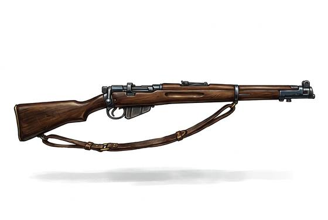

# Bolt-Action Rifle

{.illus}

*Set: Core*

*aka: ______________________________*

*Era: Steam (needs steam) · Frontier and industrial nations*

A long steel barrel on a wooden stock, fed from a box of rounds that the shooter works into the chamber by hand, one throw of the bolt at a time. It is the weapon that ended the age of armour. What a knight needed half a lifetime to learn, a farmhand learns in a season, and what the farmhand learns can kill the knight from farther away than the knight can see.

A good rifleman fires slowly and deliberately. The rifle rewards stillness, breath control and knowing the wind. Soldiers learn to fear an enemy they never see, and to live in holes in the ground.

## Game block

- **Group:** [Long Guns](../Weapon_Groups/long-guns.md) · **Damage:** 2d6· **Strength number:** 10
- **Hands:** two · **Range (m):** 5/100/300/600/1,000 · **Reload:** 5 shots, 1 round · **Weight:** 4 kg · **Price:** 15 S
- **Notes:** (sample entry already written)
- **Techniques (from the group):** Aimed Shot, Snap Shot, Wall of Shot

## Not to be confused with

the *[Flintlock Musket](flintlock-musket.md)* (Black-Powder Guns), which is loaded through the muzzle, fires once, and needs several rounds to reload.

