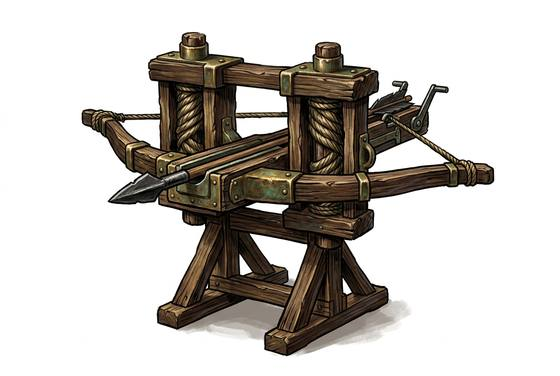

# Bolt-Thrower

{.illus}

*Set: Expansion*

*aka: ______________________________*

*Era: Iron (needs iron) · Sieges (any iron-age culture)*

A crossbow grown to the size of a cart, set on a timber frame and drawn back with a winch by two soldiers who know how to keep their fingers out of the way. Its missile is a bolt as long as a spear, iron-headed and heavy enough to pass through a shield, the man behind it and sometimes the man behind him. Armies of the iron age drag them to sieges and set them on walls and towers.

It is a precise engine. Crews use it to pick off officers on the battlements, to shoot down a ladder party or to pin a gate crew to their own gate. It can't break stone, and it is slow to wind, so it is always paired with something heavier. Besieged defenders hate the sound it makes.

## Game block

- **Group:** [Artillery & Siege Engines](../Weapon_Groups/artillery-and-siege-engines.md) · **Damage:** 2d6· **Strength number:** —
- **Crew:** 2 · **Range (m):** 20/100/200/300/400 · **Reload:** 3 rounds · **Weight:** — · **Price:** 50 G
- **Notes:** a giant crossbow on a frame
- **Techniques (from the group):** Bracket the Target, Indirect Fire

## Not to be confused with

the *[Heavy Crossbow](heavy-crossbow.md)*, the same idea at a size one soldier can carry and wind alone.

