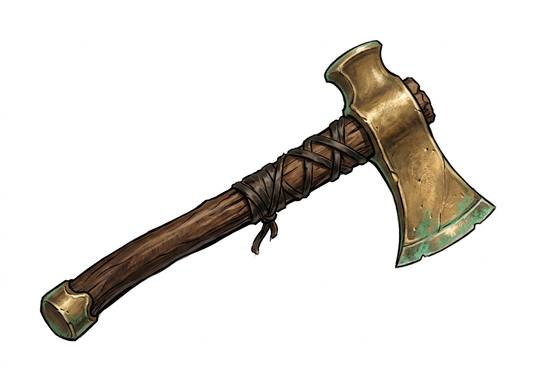

# Bronze Axe

{.illus}

*Set: Core*

*aka: ______________________________*

*Era: Bronze (needs bronze) · River kingdoms and chariot peoples · Chariot war*

A bronze head, cast in a mould and hammered hard at the edge, fixed on a wooden haft through a socket or with bindings. It is a woodcutter's tool turned into a soldier's weapon. Chariot armies use it in close fighting, and it hangs from the belts of guards, runners and foot soldiers who can't afford a sword.

The axe puts all its weight behind a narrow edge, and it bites deep into shields, leather and limbs. Bronze is soft compared with later iron, so the edge dulls fast and must be ground and hammered again. Some heads are long and narrow, almost a chisel, to punch through the scale armour that chariot warriors wear.

## Game block

- **Group:** [Axes, Maces & Clubs](../Weapon_Groups/axes-maces-and-clubs.md) · **Damage:** 1d6+1· **Strength number:** 10
- **Hands:** one · **Weight:** 1.5 kg · **Price:** 15 S
- **Techniques (from the group):** Hook the Shield, Bone-Breaker

## Not to be confused with

the *[Bearded Axe](bearded-axe.md)*, an iron axe with a hooked lower edge made for pulling shields down.

