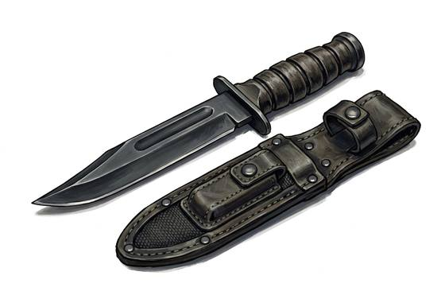

# Combat Knife

{.illus}

*Set: Expansion*

*aka: ______________________________*

*Era: Electricity (needs electricity) · Modern armies and police*

A strong, single-edged knife with a blade as long as a hand, a sturdy guard and a grip that won't slip when wet. It is issued to soldiers and bought by everyone else who wants to look like one. In the field it opens crates, cuts cord, digs holes, prises lids and makes sandwiches far more often than it touches an enemy.

When it does, the fight is close, fast and very personal: a sentry taken from behind, a wrestling match in the mud, a last resort when the rifle is empty. Commandos and special troops train to fight with it seriously. Most soldiers keep it on their belt for years and never use it in anger, and are glad of it.

## Game block

- **Group:** [Knives & Daggers](../Weapon_Groups/knives-and-daggers.md) · **Damage:** 1d4+1· **Strength number:** 6
- **Hands:** one · **Weight:** 0.3 kg · **Price:** 1 S
- **Techniques (from the group):** Inside the Guard, Through the Gap, Concealed Draw

## Not to be confused with

the *[Military Dagger](military-dagger.md)*, an older double-edged fighting knife, made for thrusting rather than for everyday work.

