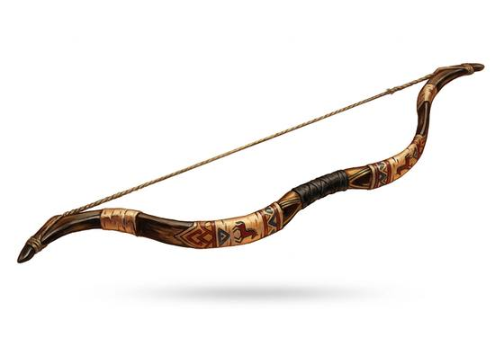

# Composite Bow

{.illus}

*Set: Core*

*aka: ______________________________*

*Era: Bronze (needs bronze) · River kingdoms and chariot peoples · Chariot war*

A bow built in layers: a core of wood, a belly of horn that resists compression, and a back of sinew that snaps back when stretched, all glued together and bound. It takes a skilled bowyer the better part of a year to make, because the glue must cure slowly. What results is short, curved and far more powerful than its size suggests.

Its shortness is its genius. An archer can draw it from a chariot or the back of a horse, where a tall bow would be useless. River kings raised whole regiments of chariot archers around it. The bow hates damp, which softens the glue, so its owners keep it in a case of leather and pray for dry weather on the day of battle.

## Game block

- **Group:** [Bows](../Weapon_Groups/bows.md) · **Damage:** 1d6+2· **Strength number:** 11
- **Hands:** two · **Range (m):** 5/30/60/100/200 · **Reload:** every round · **Weight:** 0.8 kg · **Price:** 50 S
- **Notes:** horn, wood and sinew; short enough for a chariot or saddle
- **Techniques (from the group):** Rapid Volley, Arcing Shot, Shot on the Move
- **Also appears as:** *Horse Bow* (Steppe riders); *Imperial Composite Bow* (Eastern empire)

## Not to be confused with

the *[Longbow](longbow.md)*, a single tall stave with a similar pull, which is simpler to make but far too long to use from a saddle.

