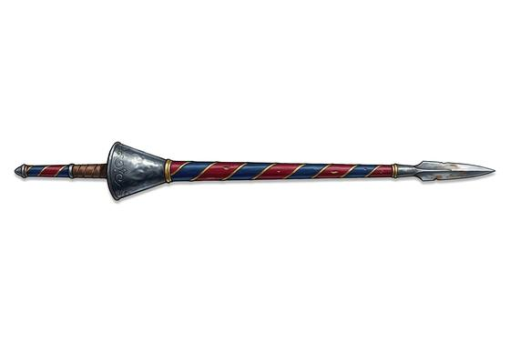

# Couched Lance

{.illus}

*Set: Expansion*

*aka: ______________________________*

*Era: Iron (needs iron) · Western kingdoms · Knightly and common warfare*

A long wooden pole with a steel point, carried by a knight on horseback. For the charge, the knight tucks it under the arm, braced against the body, and lets the horse do the rest. The whole weight of horse and rider arrives at the tip. Nothing on the battlefield hits harder.

It is a weapon of one moment. It can't be swung, it can't be used on foot, and it is useless once the charge has passed. It shatters on impact far more often than not, and a knight will carry several or have a squire with spares. Tournaments make a game of it. On the battlefield, a line of lances coming at the gallop is the most terrifying sight a foot soldier can see.

## Game block

- **Group:** [Lances](../Weapon_Groups/lances.md) · **Damage:** 2d6· **Strength number:** 13
- **Hands:** one (mounted) · **Weight:** 4 kg · **Price:** 15 S
- **Notes:** only on a charge; breaks on a hit
- **Techniques (from the group):** True Aim, Unseating Strike

## Not to be confused with

the *[Pike](pike.md)*, which is a long spear held by men on foot, waiting for the charge rather than delivering it.

