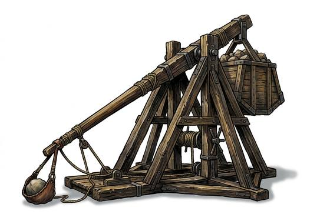

# Counterweight Engine

{.illus}

*Set: Expansion*

*aka: ______________________________*

*Era: Iron (needs iron) · Sieges (any iron-age culture)*

A timber giant, taller than a house, built on the spot by carpenters and a small army of labourers. A great box of earth and stones drops at one end of a long beam, and the other end whips over and flings a boulder the weight of a cow in a slow, high curve. It is the wall-breaker, the engine that ends sieges. Once one is built and working, the defenders start counting days.

It takes weeks to raise and a large crew to work, and between shots it is winched down with painful slowness. It can hurl more than stones: dead animals, burning pitch, the heads of captured scouts. Commanders give their engines names, and defenders make sallies at night with torches to burn them before they are finished.

## Game block

- **Group:** [Artillery & Siege Engines](../Weapon_Groups/artillery-and-siege-engines.md) · **Damage:** 6d6 (area)· **Strength number:** —
- **Crew:** 8 · **Range (m):** —/150/250/350/450 · **Reload:** 10 rounds · **Weight:** — · **Price:** 500 G
- **Notes:** the great wall-breaker
- **Techniques (from the group):** Bracket the Target, Indirect Fire

## Not to be confused with

the *[Stone-Thrower](stone-thrower.md)*, a smaller engine powered by twisted rope, quicker to build and move but unable to bring a wall down.

