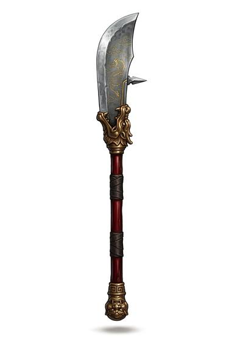

# Crescent Glaive

{.illus}

*Set: Expansion*

*aka: ______________________________*

*Era: Iron (needs iron) · Eastern empire · Imperial armies*

A long, curved blade, broad and heavy, mounted on a staff taller than the wielder, often with a small spike or hook at the back and a counterweight at the butt. It is a showpiece of the imperial armies, carried by strong soldiers and generals of legend who whirl it in great sweeping arcs.

It cuts with enormous force and reaches past any sword. In a battle line, its wielders chop at horses' legs and riders' arms. Its weight makes it hard to use in tight spaces and exhausting to swing for long. Training with it builds shoulders and patience in equal measure, and parade versions are sometimes too heavy to wield at all.

## Game block

- **Group:** [Polearms](../Weapon_Groups/polearms.md) · **Damage:** 2d6· **Strength number:** 12
- **Hands:** two · **Weight:** 3 kg · **Price:** 40 S
- **Notes:** a heavy curved blade on a long staff
- **Techniques (from the group):** Unhorse, Second Rank, Hook and Pull

## Not to be confused with

the *[Halberd](halberd.md)*, a western polearm with an axe, hook and spike, lighter and more versatile.

