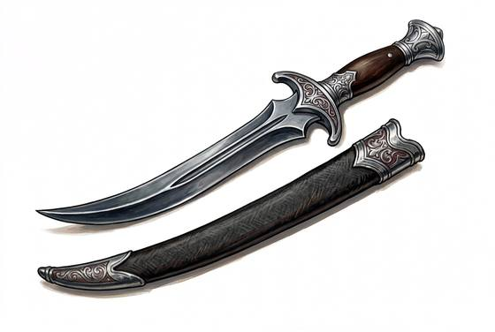

# Curved Dagger

{.illus}

*Set: Expansion*

*aka: ______________________________*

*Era: Iron (needs iron) · Desert and southern kingdoms · Riders and caravans*

A short, broad blade that bends sharply along its length, worn at the front of the sash in a sheath often grander than the knife inside. Among desert and southern peoples it is as much jewellery as weapon. A boy receives one when he becomes a man, and a guest who arrives without his is looked at oddly. Hilts are horn, bone, silver or gold, depending on who is paying.

The curve suits a fighter who is already close: a hooking stab under the ribs or a slash across the forearm that holds a blade. It is poor at parrying and useless at a distance. Most are drawn in anger rarely, and in ceremony often, and a sensible host counts them when the argument starts.

## Game block

- **Group:** [Knives & Daggers](../Weapon_Groups/knives-and-daggers.md) · **Damage:** 1d4· **Strength number:** 6
- **Hands:** one · **Weight:** 0.4 kg · **Price:** 6 S
- **Techniques (from the group):** Inside the Guard, Through the Gap, Concealed Draw

## Not to be confused with

the *[Military Dagger](military-dagger.md)*, a straight double-edged soldier's knife made for stabbing, with none of the curved dagger's ceremony.

