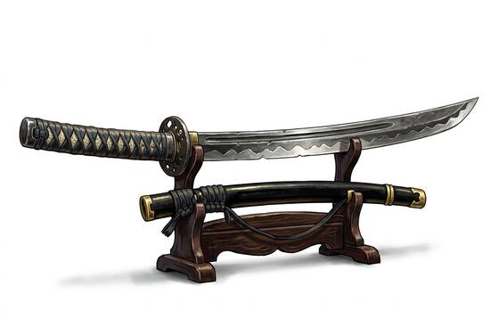

# Curved Warblade

{.illus}

*Set: Expansion*

*aka: ______________________________*

*Era: Iron (needs iron) · Island warrior houses · Retainer's code*

A single-edged, slightly curved blade, long enough to be used with two hands, with a small round guard and a long wrapped grip. It is worn thrust through the sash with the edge up, so it can be drawn and cut in a single motion. The warrior houses of the islands value it above almost anything else, and a family's finest blade can be worth more than its lands.

The smiths who make it fold and layer the steel, then harden the edge and leave the back softer so it bends rather than breaks. It cuts cleanly through cloth and flesh and can slice through a light helmet. Its schools teach calm, stillness, and the belief that the first cut should be the last.

## Game block

- **Group:** [Swords](../Weapon_Groups/swords.md) · **Damage:** 1d6+2· **Strength number:** 11
- **Hands:** one or two · **Weight:** 1.2 kg · **Price:** 12 G
- **Notes:** a single-edged, slightly curved blade, worn edge up
- **Techniques (from the group):** Half-Swording, Binding the Blade, Draw and Cut
- **Also appears as:** *Folded-Steel Longblade* (Island warrior houses)

## Not to be confused with

the *[Longsword](longsword.md)*, a straight double-edged western blade that thrusts as well as it cuts.

