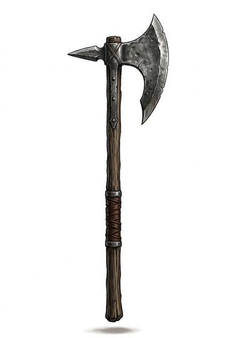

# Dane Axe

{.illus}

*Set: Core*

*aka: ______________________________*

*Era: Iron (needs iron) · Northern tribes · Raiding and shield wall*

A broad, thin, crescent-shaped iron blade on a haft as long as a man is tall. It needs both hands, a lot of room and a great deal of nerve. The warrior who carries it gives up the shield altogether and trusts to reach and fury. Northern chiefs' bodyguards were famous for it.

One blow from it can cut through a shield, a helmet or the neck of a horse. It is slower than a sword and leaves the wielder open between swings, so it is often used from behind a front rank of shield-bearers, who make space for each great stroke. A single axeman at a bridge or a gate can hold back an army, for a while.

## Game block

- **Group:** [Great Weapons](../Weapon_Groups/great-weapons.md) · **Damage:** 2d6· **Strength number:** 13
- **Hands:** two · **Weight:** 2 kg · **Price:** 20 S
- **Notes:** a long-hafted two-handed axe
- **Techniques (from the group):** Overhead Smash, Shattering Blow, Haft Guard

## Not to be confused with

the *[Bearded Axe](bearded-axe.md)*, a light one-handed axe used with a shield.

