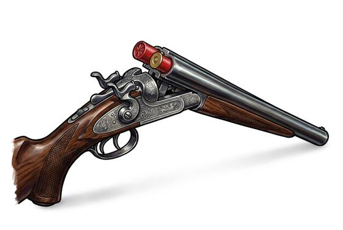

# Double-Barrel Shotgun

{.illus}

*Set: Expansion*

*aka: ______________________________*

*Era: Steam (needs steam) · Frontier and industrial nations*

Two smooth barrels side by side, hinged to break open at the breech so that two fat shells can be dropped in and snapped shut. It fires a cloud of lead pellets that spreads as it flies, which makes it forgiving to aim and devastating up close. Farmers keep one for foxes, gamekeepers for birds, coach guards for highwaymen and saloon keepers for whatever comes through the door.

Two shots, then the gun must be broken and reloaded, and the smart owner keeps spare shells between their fingers for speed. Past a short distance the spread thins to nothing much. Sawn off short it hides under a coat, and becomes a weapon of robberies and doorway ambushes, loud, messy and final.

## Game block

- **Group:** [Long Guns](../Weapon_Groups/long-guns.md) · **Damage:** 2d6· **Strength number:** 9
- **Hands:** two · **Range (m):** 2/10/20/40/60 · **Reload:** 2 shots, 1 round · **Weight:** 3.5 kg · **Price:** 12 S
- **Notes:** +3 to hit at point blank and short
- **Techniques (from the group):** Aimed Shot, Snap Shot, Wall of Shot

## Not to be confused with

the *[Pump Shotgun](pump-shotgun.md)*, a later scatter-gun that holds more shells in a tube and cycles them by sliding the fore-end.

