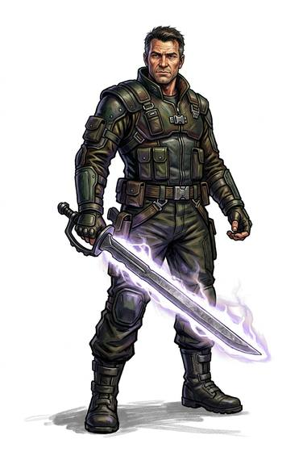

# Energy Blade

{.illus}

*Set: Expansion*

*aka: ______________________________*

*Era: Spaceflight (needs spaceflight) · Star navies and marines*

A hilt that projects a blade of shimmering energy, held in shape by a field and hot enough to cut through metal plate. It hums when drawn and hisses when it strikes, and it weighs almost nothing: all the weight is in the hilt. It is rare and costly, carried by officers, duellists, bodyguards and those who want to be seen carrying one.

It is a dangerous weapon to learn. With no weight in the blade, the swordsman gets little feeling of where the edge is, and a careless swing can take off a limb, and not always the enemy's. It cuts armour as if it were cloth, which makes it the terror of close fights aboard ships and stations.

## Game block

- **Group:** [Energy Blades](../Weapon_Groups/energy-blades.md) · **Damage:** 2d6+1· **Strength number:** 4
- **Hands:** one or two · **Weight:** 0.8 kg · **Price:** 50 S
- **Notes:** armour counts half; a fumble cuts the wielder
- **Techniques (from the group):** Burning Parry, Through the Plate

## Not to be confused with

the *[Longsword](longsword.md)*, a steel blade that must find gaps in armour instead of simply cutting through it.

