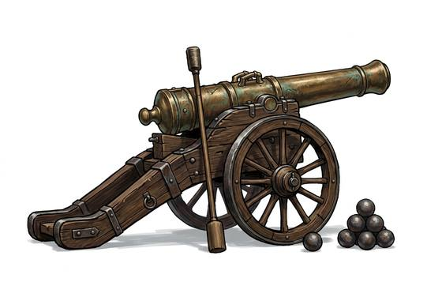

# Field Cannon

{.illus}

*Set: Expansion*

*aka: ______________________________*

*Era: Gunpowder (needs gunpowder) · Pike-and-shot armies*

A bronze or iron barrel on a heavy wooden carriage with two tall wheels, hauled by horses and served by a crew who work in a practised rhythm: sponge, load, ram, aim, prime, fire. It throws a solid iron ball that bounces through ranks of men, or a can of small balls that turns into a storm at close range. On a battlefield of muskets, the guns decide where the fighting happens.

It is loud beyond belief, and a gunner who serves one for years goes half deaf. Its crew are tempting targets, and a charge that reaches a battery captures it outright. Old gunners spike a gun they must abandon with a nail through the touch-hole, so that the enemy can't turn it on them.

## Game block

- **Group:** [Artillery & Siege Engines](../Weapon_Groups/artillery-and-siege-engines.md) · **Damage:** 5d6 (area)· **Strength number:** —
- **Hands:** crew 4 · **Range (m):** 20/200/500/800/1,200 · **Reload:** 6 rounds · **Weight:** 600 kg · **Price:** 500 G
- **Notes:** on a wheeled carriage
- **Techniques (from the group):** Bracket the Target, Indirect Fire

## Not to be confused with

the *[Stone-Thrower](stone-thrower.md)*, an older siege engine that lobs stones by twisted rope and can't fire straight through a line of men.

