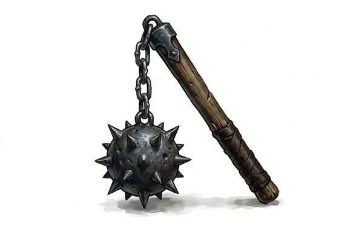

# Flail

{.illus}

*Set: Expansion*

*aka: ______________________________*

*Era: Iron (needs iron) · Western kingdoms · Knightly and common warfare*

A wooden handle joined by a short chain or hinge to a heavy striking head, often an iron ball studded with spikes. When swung, the head whips around in an arc, gathering speed as it goes, and strikes with far more force than the wielder's arm alone could give.

Its chief virtue is that it swings over and around a shield, hitting the man behind it. Its chief vice is that it is almost impossible to control. The same swing that flies over a shield can come back at the wielder, and there is no way to catch a blow with a chain. It is a weapon of fury and fear, and those who use it well are rare.

## Game block

- **Group:** [Flails & Chains](../Weapon_Groups/flails-and-chains.md) · **Damage:** 1d6+2· **Strength number:** 12
- **Hands:** one · **Weight:** 1.8 kg · **Price:** 25 S
- **Notes:** swings around a shield; −2 to your own Parry
- **Techniques (from the group):** Over the Shield, Wrap and Pull

## Not to be confused with

the *[Flanged Mace](flanged-mace.md)*, which is a solid haft that hits almost as hard but can be controlled and used to guard.

