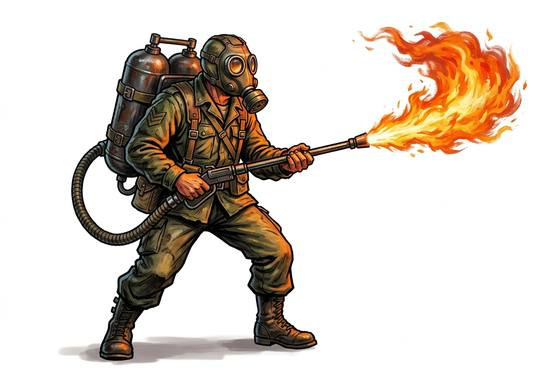

# Flamethrower

{.illus}

*Set: Expansion*

*aka: ______________________________*

*Era: Electricity (needs electricity) · Modern armies and police*

A pack of fuel tanks strapped to the back, joined by a hose to a long nozzle with a pilot flame at its tip. Squeeze the trigger and a rope of burning fuel pours out, sticks to whatever it touches and keeps burning. It is used to clear bunkers, trenches, caves and tunnels, where the fire flows round corners and eats the air inside.

It is terrifying to face and nearly as terrifying to carry. The operator is slow, bulky and short of reach, and every enemy soldier tries to hit the tanks. Its fuel runs out quickly. Armour does little good against it, because heat and smoke go where blades and bullets can't. Soldiers speak of it with a mixture of reliance and disgust.

## Game block

- **Group:** [Heavy Weapons & Launchers](../Weapon_Groups/heavy-weapons-and-launchers.md) · **Damage:** 2d6 to everyone in a 10 m cone· **Strength number:** 12
- **Hands:** two · **Range (m):** 2/10/20/30/— · **Reload:** 10 bursts · **Weight:** 30 kg · **Price:** 20 S
- **Notes:** sets targets alight; armour counts half
- **Techniques (from the group):** Set the Gun, Leading the Target

## Not to be confused with

the *[Early Grenade](early-grenade.md)*, a burning bomb thrown by hand, which scatters iron rather than spraying liquid fire.

