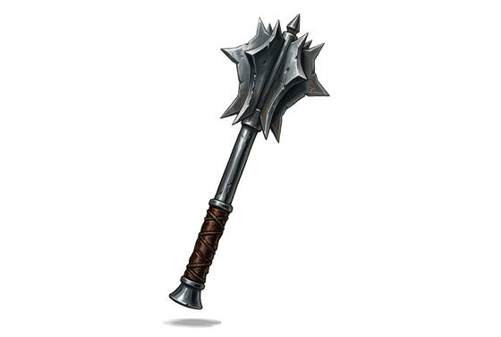

# Flanged Mace

{.illus}

*Set: Expansion*

*aka: ______________________________*

*Era: Iron (needs iron) · Western kingdoms · Knightly and common warfare*

An iron or steel head made of a ring of thin, upright blades, the flanges, on a short haft. It looks like a crown of axes. It is the answer to plate armour: where a sword slides off a breastplate, the flanges bite into the steel, dent it and drive the shock through into the body behind.

Knights, bishops' guards and town militias all favour it, because it needs less skill than a sword and does more against armour. One well-placed blow can crush a helmet or break an arm inside its plate. It is short and heavy, useless against anyone at a distance, but in the press of a melee it breaks men who thought their steel made them safe.

## Game block

- **Group:** [Axes, Maces & Clubs](../Weapon_Groups/axes-maces-and-clubs.md) · **Damage:** 1d6+2· **Strength number:** 11
- **Hands:** one · **Weight:** 1.5 kg · **Price:** 20 S
- **Notes:** weak point penalty −2 instead of −4 against plate (draft)
- **Techniques (from the group):** Hook the Shield, Bone-Breaker

## Not to be confused with

the *[War Hammer](war-hammer.md)*, which puts all its weight behind a small beak or face; the mace spreads the blow over the flanges.

