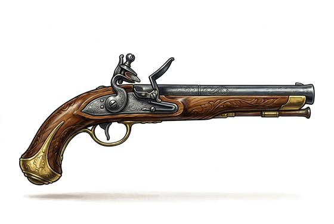

# Flintlock Pistol

{.illus}

*Set: Core*

*aka: ______________________________*

*Era: Gunpowder (needs gunpowder) · Pike-and-shot armies*

A short gun with a flint lock and a heavy wooden butt, carried in pairs by cavalry officers, highwaymen, sea captains and gentlemen who expect to be insulted. It fires once. After that, reloading takes long enough that most owners simply draw the second one, and after that they turn the pistol round and use the butt as a club.

At arm's length it is deadly. Across a room it is uncertain, and across a field it is a noise. Duels are fought with matched pairs at a measured distance, where honour is satisfied as often by a miss as by a hit. A cocked pistol held to someone's head ends more arguments than it starts, which is its real work.

## Game block

- **Group:** [Black-Powder Guns](../Weapon_Groups/black-powder-guns.md) · **Damage:** 1d6+1· **Strength number:** 6
- **Hands:** one · **Range (m):** 2/10/20/30/50 · **Reload:** 4 rounds · **Weight:** 1.2 kg · **Price:** 20 G
- **Techniques (from the group):** Drilled Reload, Point-Blank Discharge

## Not to be confused with

the *[Revolver](revolver.md)*, a later handgun that holds several shots in a turning cylinder instead of just one.

