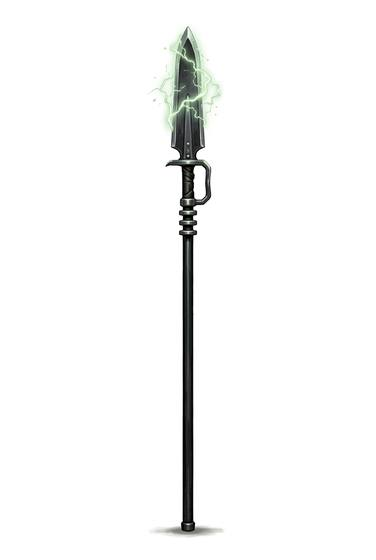

# Force Pike

{.illus}

*Set: Expansion*

*aka: ______________________________*

*Era: Spaceflight (needs spaceflight) · Star navies and marines*

A long staff with a charged head, used by naval guards and ceremonial troops of the star navies. Its tip carries a field that stuns on contact, and its blade is sharp enough to wound if the operator wants to wound. It is a weapon for guarding doors, holding corridors and controlling crowds, where its reach keeps trouble at arm's length and more.

In a boarding action, a line of force pikes can hold a hatch against a rush, and stunned attackers pile up in the doorway. Honour guards carry them at attention for hours on end. It is heavy for a starship weapon and awkward in narrow spaces, which is why its bearers are trained to fight it short.

## Game block

- **Group:** [Polearms](../Weapon_Groups/polearms.md) · **Damage:** 2d6· **Strength number:** 9
- **Hands:** two · **Weight:** 3 kg · **Price:** 15 S
- **Notes:** the head carries a stunning charge
- **Techniques (from the group):** Unhorse, Second Rank, Hook and Pull

## Not to be confused with

the *[Halberd](halberd.md)*, an old iron-age polearm of axe blade and spike, which cuts and pierces but carries no stunning charge.

