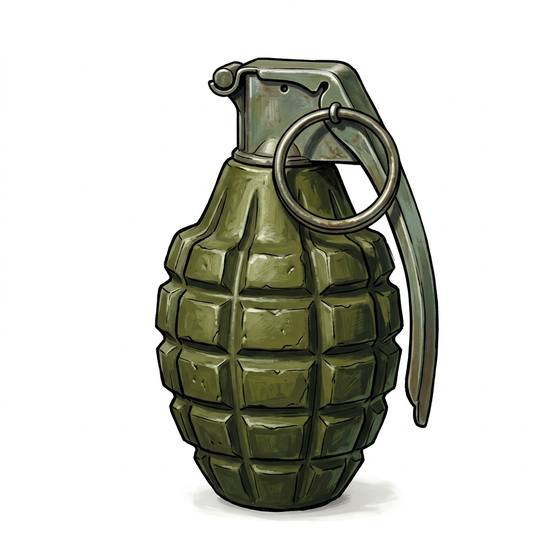

# Fragmentation Grenade

{.illus}

*Set: Core*

*aka: ______________________________*

*Era: Electricity (needs electricity) · Modern armies and police*

A small metal body packed with explosive, fitted with a spring lever held down by a safety pin. Pull the pin, keep a grip on the lever, throw; once the lever flies free, a short fuse burns and the grenade bursts, filling the space around it with jagged fragments. Every soldier carries a few, and learns early to count before throwing.

It is the weapon for enemies out of sight: behind a wall, in a trench, down a stairwell, inside a room. It rolls, bounces and occasionally comes back. Throwing well is a skill; staying calm when one lands nearby is another. A grenade in the hands of an untrained person is more danger to their friends than to anyone else.

## Game block

- **Group:** [Thrown Weapons](../Weapon_Groups/thrown-weapons.md) · **Damage:** 2d6 within 1 pace, 1d6 within 3, nothing beyond· **Strength number:** 6
- **Hands:** one · **Range (m):** 2/10/20/30/40 · **Weight:** 0.4 kg · **Price:** 1 S
- **Techniques (from the group):** Draw and Throw, Pinning Throw, Grenade Cook

## Not to be confused with

the *[Early Grenade](early-grenade.md)*, the older powder bomb lit by a fuse from a slow match, far less reliable.

