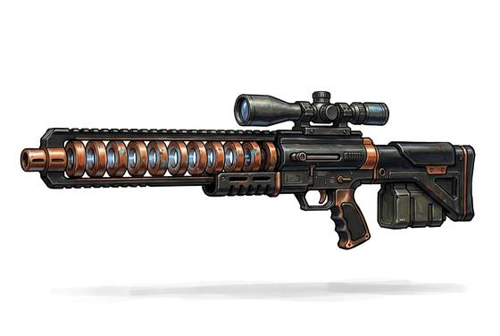

# Gauss Rifle

{.illus}

*Set: Expansion*

*aka: ______________________________*

*Era: Spaceflight (needs spaceflight) · Star navies and marines*

A rifle that throws a slender metal slug down its barrel using a sequence of electromagnets instead of burning powder. There is no flash and no bang, only a soft click and the crack of the slug breaking the sound barrier far away. Its slugs travel fast enough to punch through armour and cross enormous distances with barely any drop.

Marine snipers and assassins love it for its silence. Its power pack is heavy, and the rifle takes a moment to charge between shots. Magnetic fields around ships and stations can confuse its aim, and some old soldiers never trust anything without a bang. But few weapons are more feared, because by the time anyone hears it, the shot has already landed.

## Game block

- **Group:** [Long Guns](../Weapon_Groups/long-guns.md) · **Damage:** 2d6+2· **Strength number:** 9
- **Hands:** two · **Range (m):** 10/200/600/1,000/2,000 · **Reload:** 20 shots, 1 round · **Weight:** 6 kg · **Price:** 40 S
- **Notes:** magnetic; silent
- **Techniques (from the group):** Aimed Shot, Snap Shot, Wall of Shot

## Not to be confused with

the *[Sniper Rifle](sniper-rifle.md)*, the older long-range rifle, which uses gunpowder and makes a great deal more noise.

