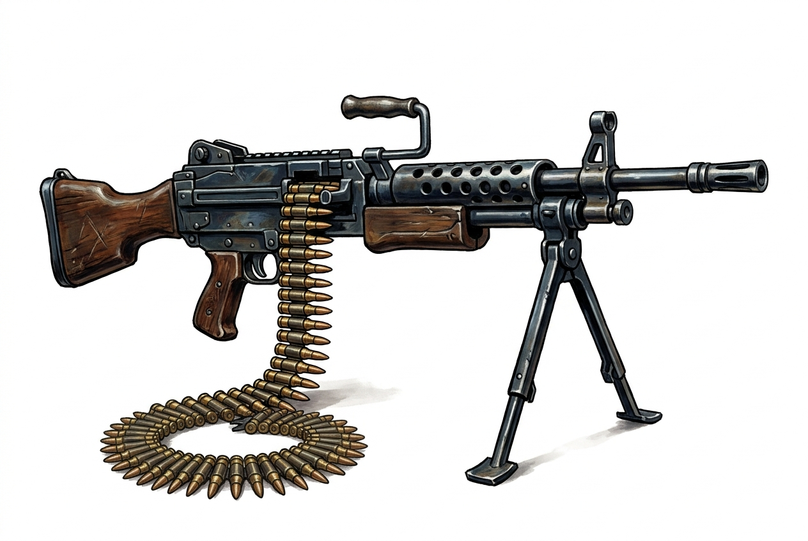

# General-Purpose Machine Gun

{.illus}

*Set: Expansion*

*aka: ______________________________*

*Era: Electricity (needs electricity) · Modern armies and police*

A belt-fed gun that fires rifle rounds for as long as the trigger is held and the belt keeps feeding. Carried by a team of two or three soldiers, one to fire, one to feed the belt and haul spare barrels, it is the backbone of a modern infantry section. Set up on its folding legs, or on a tripod, a vehicle or a boat, it throws a stream of fire that dominates open ground.

Fired from the hip it is a heavy, wild thing, useful only for noise. Braced on its bipod it becomes accurate and terrible. The barrel glows when pushed too hard and must be swapped, and the belts run out quicker than anyone expects. Enemy fire seeks it out first.

## Game block

- **Group:** [Heavy Weapons & Launchers](../Weapon_Groups/heavy-weapons-and-launchers.md) · **Damage:** 2d6+1· **Strength number:** 14
- **Hands:** two (bipod) · **Range (m):** 5/100/400/800/1,200 · **Reload:** 100-round belt, 2 rounds · **Weight:** 11 kg · **Price:** 50 S
- **Notes:** bursts; best braced or on a bipod
- **Techniques (from the group):** Set the Gun, Leading the Target

## Not to be confused with

the *[Hand-Cranked Gun](hand-cranked-gun.md)*, its ancestor, which was turned by hand on a carriage and fired far more slowly.

