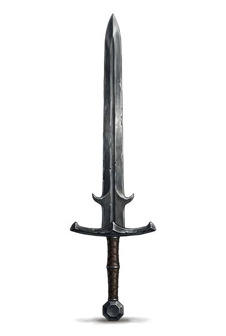

# Greatsword

{.illus}

*Set: Core*

*aka: ______________________________*

*Era: Iron (needs iron) · Western kingdoms · Knightly and common warfare*

A sword so long it stands to the wielder's chin when its point rests on the ground, with a long grip, wide crossguard and often a second guard of small hooks further down the blade. It needs both hands, a lot of room and a strong back. Mercenaries and champions carry it on their shoulders, and they are well paid for the privilege.

Its great sweeps clear space and break pike shafts, and its reach keeps lesser weapons away. It is too big to wear at the hip; it rides on the shoulder or across the saddle. A skilled wielder shifts grips constantly, choking up on the blade for close work. An unskilled one is a danger to everyone near him.

## Game block

- **Group:** [Two-Handed Swords](../Weapon_Groups/two-handed-swords.md) · **Damage:** 2d6· **Strength number:** 14
- **Hands:** two · **Weight:** 3 kg · **Price:** 15 G
- **Techniques (from the group):** Sweeping Arc, Grip the Ricasso
- **Also appears as:** *Great War Sword* (Western kingdoms)

## Not to be confused with

the *[Longsword](longsword.md)*, a smaller blade for one or two hands that is quicker to recover and can be used with a shield.

