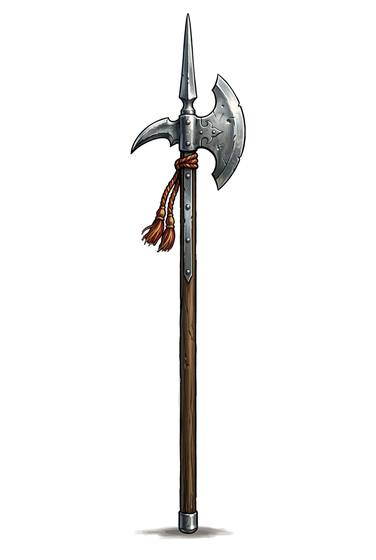

# Halberd

{.illus}

*Set: Core*

*aka: ______________________________*

*Era: Iron (needs iron) · Western kingdoms · Knightly and common warfare*

An axe blade on a long pole, backed by a hook and topped with a spike. It is the weapon of the common foot soldier, the town militia and the mountain valleys that defend themselves against mounted knights. It is cheap, needs little training for basic use and does terrible damage.

It thrusts at an approaching horse, hooks a rider out of his saddle and chops through a helmet once he's on the ground. In a crowd, the spike keeps enemies back, and the axe blade falls on any who come too close. It is a weapon for masses and for close ranks, not for fine duelling. It has outlived its usefulness in battle and still stands at palace gates, polished and ceremonial.

## Game block

- **Group:** [Polearms](../Weapon_Groups/polearms.md) · **Damage:** 2d6· **Strength number:** 13
- **Hands:** two · **Weight:** 3 kg · **Price:** 30 S
- **Techniques (from the group):** Unhorse, Second Rank, Hook and Pull

## Not to be confused with

the *[Poleaxe](poleaxe.md)*, a knight's weapon that is shorter and has more tricks, but needs years of training.

