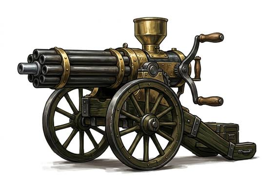

# Hand-Cranked Gun

{.illus}

*Set: Expansion*

*aka: ______________________________*

*Era: Steam (needs steam) · Frontier and industrial nations*

A cluster of barrels around a central shaft, mounted on a wheeled carriage like a small cannon, and fired by turning a crank on the side. Each turn brings each barrel round in turn to be loaded, fired and emptied, and the gun spits bullets in a steady, rattling stream for as long as the crank turns and the hopper is full. Its inventors claimed it would make war too terrible to wage.

It was wrong about that. The gun is heavy, needs horses to move and a crew to feed and work it, and jams when the gunner cranks too eagerly. Set on a ridge, a bridge or the corner of a fort, it can stop a charge dead. Colonial armies loved it. Their enemies learned to hate the sound.

## Game block

- **Group:** [Heavy Weapons & Launchers](../Weapon_Groups/heavy-weapons-and-launchers.md) · **Damage:** 2d6· **Strength number:** —
- **Hands:** crew 2 · **Range (m):** 5/100/300/600/1,000 · **Reload:** bursts; 40 shots, 3 rounds · **Weight:** 40 kg · **Price:** 30 G
- **Notes:** on a carriage
- **Techniques (from the group):** Set the Gun, Leading the Target

## Not to be confused with

the *[General-Purpose Machine Gun](general-purpose-machine-gun.md)*, a later gun that fires itself from a belt by its own recoil or gas, needing no crank.

