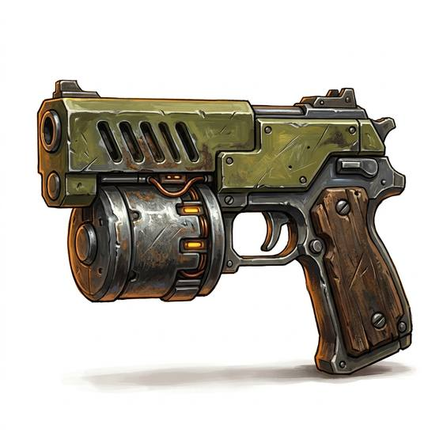

# Heavy Blaster Pistol

{.illus}

*Set: Expansion*

*aka: ______________________________*

*Era: Spaceflight (needs spaceflight) · Frontier settlers and smugglers*

A big, blocky sidearm that fires a bolt of charged energy, favoured by frontier settlers, smugglers, bounty hunters and anyone else who wants one shot to settle the matter. It trades range and ammunition for weight of hit: at close quarters it punches holes in armour and hulls alike, and the air where it fires smells of ozone and hot metal.

Its power cell drains quickly, and past a short distance the bolts spread and weaken. It is heavy on the hip and gets heavier when a quick draw matters. Frontier folk trust it because it is simple and hard to break. Navy officers look down on it, and then want one the first time they visit a rough spaceport bar.

## Game block

- **Group:** [Energy Weapons](../Weapon_Groups/energy-weapons.md) · **Damage:** 1d6+1· **Strength number:** 7
- **Hands:** one · **Range (m):** 5/15/30/50/80 · **Reload:** 10 shots per cell, 1 round · **Weight:** 1.5 kg · **Price:** 20 S
- **Notes:** short range, heavy hit
- **Techniques (from the group):** Overcharge, Sweeping Beam

## Not to be confused with

the *[Laser Pistol](laser-pistol.md)*, the navy's lighter sidearm, with more shots and longer reach but a weaker hit.

