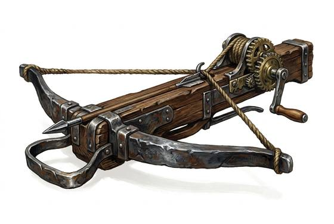

# Heavy Crossbow

{.illus}

*Set: Expansion*

*aka: ______________________________*

*Era: Iron (needs iron) · Western kingdoms · Knightly and common warfare*

A crossbow with a steel bow so stiff that no one can pull it back by hand. The crossbowman fits a crank or a windlass to the stock and winds the string back, turn after turn, before dropping in the bolt. It is heavy, slow and awkward. It also sends a bolt through plate armour at a distance that a knight thinks is safe.

The heavy crossbow is a siege weapon and a garrison weapon. Its crews shelter behind large shields, winding and shooting while spearmen guard them. Knights despised it, and some churchmen tried to ban it against fellow believers, because it let a low-born man kill a lord from a hundred paces. Nobody listened for long.

## Game block

- **Group:** [Crossbows](../Weapon_Groups/crossbows.md) · **Damage:** 2d6· **Strength number:** 8
- **Hands:** two · **Range (m):** 5/40/80/150/300 · **Reload:** 3 rounds · **Weight:** 6 kg · **Price:** 10 G
- **Notes:** wound with a crank
- **Techniques (from the group):** Held at the Ready, Quick Span

## Not to be confused with

the *[Light Crossbow](light-crossbow.md)*, which is drawn by hand or with a lever and shoots faster but hits less hard.

