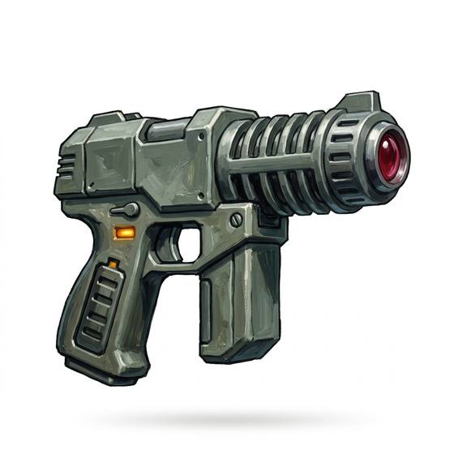

# Laser Pistol

{.illus}

*Set: Core*

*aka: ______________________________*

*Era: Spaceflight (needs spaceflight) · Star navies and marines*

A sleek handgun that fires a pulse of focused light rather than a bullet. There is no recoil, no bullet drop and no drift in the wind, only a bright line and a sizzle where it lands. It draws power from a charged cell in the grip, and a spent cell slides out as easily as a magazine. The star navies issue it to officers and marines, and anyone with the money can buy one.

Its beam goes straight to where it is aimed, which makes it easy to shoot well. It burns rather than tears, cauterising the wounds it makes. Smoke, fog and mirrored armour all weaken it, and a careless shooter who fires in a ship's corridor learns about reflections the hard way.

## Game block

- **Group:** [Energy Weapons](../Weapon_Groups/energy-weapons.md) · **Damage:** 1d6+2· **Strength number:** 5
- **Hands:** one · **Range (m):** 5/20/40/80/150 · **Reload:** 20 shots per cell, 1 round · **Weight:** 1 kg · **Price:** 12 S
- **Notes:** range penalties halved
- **Techniques (from the group):** Overcharge, Sweeping Beam

## Not to be confused with

the *[Laser Rifle](laser-rifle.md)*, the same beam in a long gun, with more shots per cell and far greater reach.

