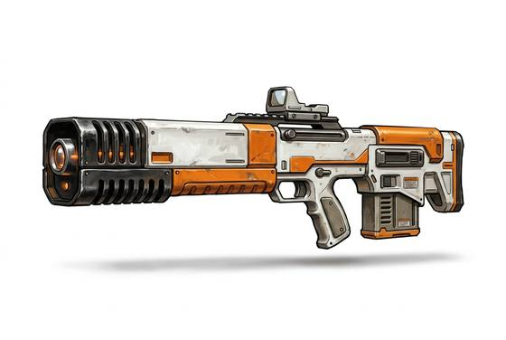

# Laser Rifle

{.illus}

*Set: Core*

*aka: ______________________________*

*Era: Spaceflight (needs spaceflight) · Star navies and marines*

A long gun that fires pulses of coherent light, standard issue in the star navies and among marine boarding parties. It has no moving parts to jam and no recoil to throw off the next shot, and its beam travels straight and true across distances that would make a musketeer weep. A power cell slots into the stock, and a marine carries several spares.

It is quiet except for a crack of heated air and a faint hum while it charges. In vacuum it is silent and invisible until something burns. Its beam weakens in dust, smoke and heavy rain, and troops fighting with it learn to lay down smoke of their own. Veterans say it is too easy to shoot, and that this is exactly the problem.

## Game block

- **Group:** [Energy Weapons](../Weapon_Groups/energy-weapons.md) · **Damage:** 2d6· **Strength number:** 7
- **Hands:** two · **Range (m):** 5/100/300/600/1,000 · **Reload:** 40 shots per cell, 1 round · **Weight:** 3 kg · **Price:** 20 S
- **Notes:** range penalties halved
- **Techniques (from the group):** Overcharge, Sweeping Beam

## Not to be confused with

the *[Plasma Rifle](plasma-rifle.md)*, which hurls bolts of superheated gas that hit much harder, but overheats and has fewer shots per cell.

