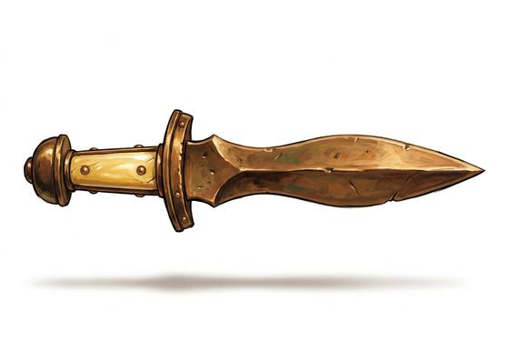

# Leaf-Blade Sword

{.illus}

*Set: Core*

*aka: ______________________________*

*Era: Bronze (needs bronze) · Sea peoples and city-states · Shield line*

A short bronze sword whose blade narrows at the grip and swells before tapering to a point, like a leaf. It is quick in the hand, sharp on both edges and pointed for the thrust. Most soldiers of the shield line carry one at the hip without ever expecting to use it.

It earns its keep when the spear breaks or the line dissolves into a scramble. Then it slashes and stabs at close quarters, where a long shaft only gets in the way. Bronze needs regular sharpening, and a good sword is costly, so many carry blades handed down from fathers and grandfathers. A soldier who loses his spear and still holds the line is remembered.

## Game block

- **Group:** [Swords](../Weapon_Groups/swords.md) · **Damage:** 1d6+1· **Strength number:** 9
- **Hands:** one · **Weight:** 1 kg · **Price:** 40 S
- **Notes:** a sidearm for when the spear breaks
- **Techniques (from the group):** Half-Swording, Binding the Blade, Draw and Cut

## Not to be confused with

the *[Short Stabbing Sword](short-stabbing-sword.md)*, an iron blade made purely for thrusting from behind a large shield.

