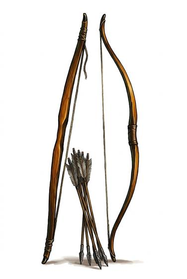

# Longbow

{.illus}

*Set: Core*

*aka: ______________________________*

*Era: Iron (needs iron) · Western kingdoms · Knightly and common warfare*

A plain stave of springy wood, taller than the archer, strung with linen or gut. It is nothing to look at and a great deal to master. A longbowman is built by the bow: years of drawing it give him a thick back, a crooked spine and one arm stronger than the other. Laws once required whole villages to practise on feast days, because an army of archers can't be raised in a season.

At short range the arrow goes through mail and anything softer. At long range, loosed in thousands, it falls like hail on horses and on men who have to look up to see it coming. Plate turns most arrows, and wet weather ruins strings, so wise archers keep a spare under their hat.

## Game block

- **Group:** [Bows](../Weapon_Groups/bows.md) · **Damage:** 1d6+2· **Strength number:** 13
- **Hands:** two · **Range (m):** 5/30/60/100/200 · **Reload:** every round · **Weight:** 1 kg · **Price:** 30 S
- **Notes:** (sample entry already written)
- **Techniques (from the group):** Rapid Volley, Arcing Shot, Shot on the Move

## Not to be confused with

the *[Light Crossbow](light-crossbow.md)*, which anyone can learn quickly and which hits harder, but reloads slowly.

