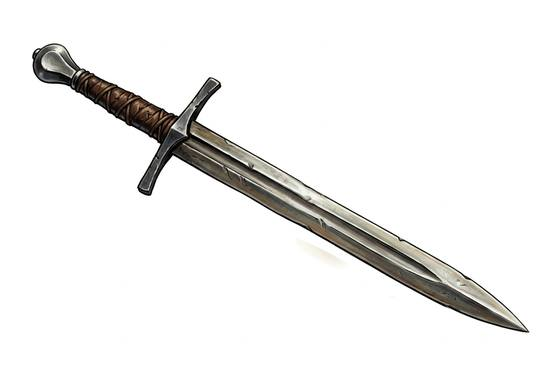

# Longsword

{.illus}

*Set: Core*

*aka: ______________________________*

*Era: Iron (needs iron) · Western kingdoms · Knightly and common warfare*

A straight, double-edged blade as long as a man's arm, with a cross-shaped guard and a grip long enough for one hand or two. It is the weapon of people who can afford steel and the years it takes to learn it. Hung at the hip, it marks the wearer as someone who expects to be obeyed. In the hand, it is lighter than it looks and quicker than anyone expects. The edge cuts cloth and flesh, the point finds the gaps in armour, and the guard catches a blade that comes too close.

Against a man in mail, the longsword is a tool of patience. Few cuts get through, so the swordsman thrusts, binds the other blade and waits for an armpit or a visor. A knight in full plate is barely troubled by the edge at all, which is why masters learn to grip their own blade halfway down and use it like a short, heavy spear.

## Game block

- **Group:** [Swords](../Weapon_Groups/swords.md) · **Damage:** 1d6+1· **Strength number:** 12
- **Hands:** one or two · **Weight:** 1.5 kg · **Price:** 80 S
- **Notes:** (sample entry already written)
- **Techniques (from the group):** Half-Swording, Binding the Blade, Draw and Cut
- **Also appears as:** *Knight's Sword* (Western kingdoms)

## Not to be confused with

the *[Greatsword](greatsword.md)*, a two-handed weapon (Two-Handed Swords group) that hits harder but gives up the shield and the quick recovery.

