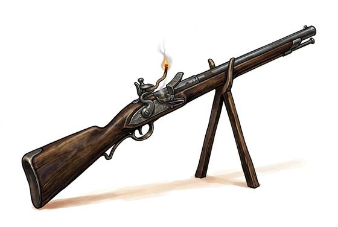

# Matchlock Musket

{.illus}

*Set: Expansion*

*aka: ______________________________*

*Era: Gunpowder (needs gunpowder) · Pike-and-shot armies*

A long, heavy gun whose charge is fired by a smouldering cord clamped in a lever: pull the trigger and the glowing end drops into a pan of priming powder. It is the first firearm that ordinary soldiers can use in large numbers, and it changed the battlefield as much as any weapon ever has. The musketeer walks with the match lit at both ends, wrapped around his arm, smelling of smoke.

Everything about it is slow and fussy. Powder is poured, ball rammed, pan primed, match blown on and adjusted. Rain and wind put the match out or soak the pan. Yet a line of them firing together, sheltered behind a hedge of pikes, will shatter a charge that no archer could stop, and the fellows who shoot them need only weeks of training.

## Game block

- **Group:** [Black-Powder Guns](../Weapon_Groups/black-powder-guns.md) · **Damage:** 2d6+1· **Strength number:** 10
- **Hands:** two · **Range (m):** 5/30/60/100/200 · **Reload:** 5 rounds · **Weight:** 5 kg · **Price:** 12 G
- **Notes:** misfires on a natural 20 in rain
- **Techniques (from the group):** Drilled Reload, Point-Blank Discharge

## Not to be confused with

the *[Flintlock Musket](flintlock-musket.md)*, which sparks its powder with a flint instead of a burning cord and so fires more reliably in the wet.

