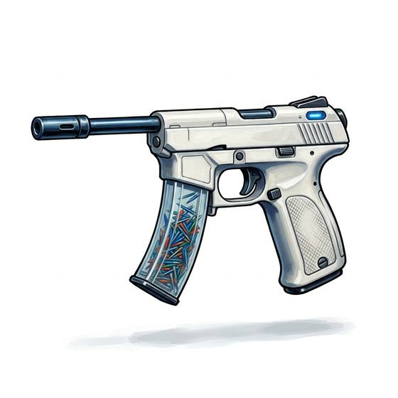

# Needle Gun

{.illus}

*Set: Expansion*

*aka: ______________________________*

*Era: Spaceflight (needs spaceflight) · Frontier settlers and smugglers*

A slim handgun that fires tiny flechettes, thin as sewing needles, driven by compressed gas or a magnetic coil. It is almost silent and its wounds are small, which is the point: the needles carry poison, sedatives or tracking agents, and the target may not even notice being hit until the drug takes hold. Assassins, spies, police and hunters of dangerous creatures all have uses for it.

Its needles bounce off anything heavier than a coat, so it is useless against armour. Its magazine holds a great many needles, and the shooter can load different drugs for different work. A dart that brings sleep and one that kills look exactly the same, which is a fact security staff lose sleep over.

## Game block

- **Group:** [Handguns](../Weapon_Groups/handguns.md) · **Damage:** 1d6· **Strength number:** 5
- **Hands:** one · **Range (m):** 5/15/30/50/80 · **Reload:** 50 shots, 1 round · **Weight:** 0.6 kg · **Price:** 8 S
- **Notes:** silent; carries poison or sedative
- **Techniques (from the group):** Quick Draw, Two-Gun Fire, Fan the Hammer

## Not to be confused with

the *[Blowgun](blowgun.md)*, the ancient tube that fires one poisoned dart by breath, which the needle gun resembles in purpose.

