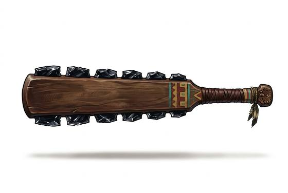

# Obsidian-Edged Club

{.illus}

*Set: Expansion*

*aka: ______________________________*

*Era: Iron (needs iron) · Jungle and highland empires · Capture warfare*

A flat paddle of hard wood, as long as an arm, with a row of volcanic glass blades set into each edge with resin. The glass is sharper than any steel, sharp enough to take a horse's head off in legend and a man's hand off in fact. The warriors of jungle and highland empires carry it into battles fought less to kill than to take captives, and a skilled fighter knows exactly how to wound without finishing the job.

Its great weakness is that glass is glass. Against cloth, skin and quilted cotton it is terrifying. Against metal armour the blades chip and snap after a few blows, and the weapon becomes an ordinary club with teeth missing. Its owners carry spare flakes and keep a craftsman close to the camp.

## Game block

- **Group:** [Axes, Maces & Clubs](../Weapon_Groups/axes-maces-and-clubs.md) · **Damage:** 1d6+2· **Strength number:** 10
- **Hands:** one or two · **Weight:** 1.5 kg · **Price:** 15 S
- **Notes:** razor-sharp but brittle; armour counts double against it
- **Techniques (from the group):** Hook the Shield, Bone-Breaker

## Not to be confused with

the *[Wooden Club](wooden-club.md)*, a plain cudgel that bruises rather than cuts and never needs its edges replaced.

