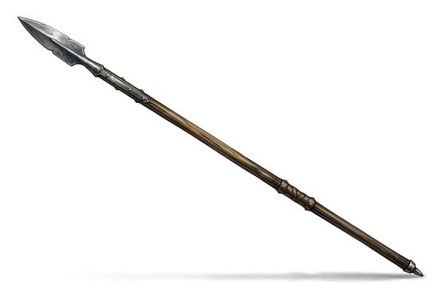

# Pike

{.illus}

*Set: Expansion*

*aka: ______________________________*

*Era: Iron (needs iron) · Western kingdoms · Knightly and common warfare*

A spear so long that three or four men can hold it at once, all ranks of them bristling out from a deep, square block of foot soldiers. It has a small steel head and an ash shaft longer than a house is tall. On its own it is almost useless. In a block of hundreds, it is a hedge of points no horse will charge.

Pikemen stand close, and the front ranks lower their pikes while the rear ranks raise theirs to break falling arrows. The block moves as one, slowly, and pushes. Its reach means that anyone with a shorter weapon must get past a thicket of points before striking back. A broken block, though, is a crowd of men holding very long sticks.

## Game block

- **Group:** [Polearms](../Weapon_Groups/polearms.md) · **Damage:** 1d6+2· **Strength number:** 12
- **Hands:** two · **Weight:** 5 kg · **Price:** 10 S
- **Notes:** strikes first against anyone with a shorter weapon
- **Techniques (from the group):** Unhorse, Second Rank, Hook and Pull

## Not to be confused with

the *[Thrusting Spear](thrusting-spear.md)*, a much shorter spear used in one hand behind a shield.

