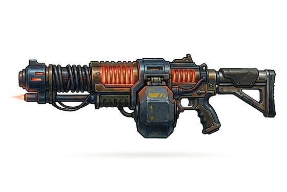

# Plasma Rifle

{.illus}

*Set: Expansion*

*aka: ______________________________*

*Era: Spaceflight (needs spaceflight) · Star navies and marines*

A heavy energy weapon that heats a pellet of gas into plasma and hurls it at the target inside a magnetic sheath. What arrives is a bolt of star-hot matter that melts armour plate, burns through walls and leaves a smell of scorched metal in the air. Marines carry it when they expect to meet armour, and cooling vanes along its barrel glow when it has been worked too hard.

The rifle must breathe between bursts. Fire it too often and it overheats, locking until the vents have cleared, and a careless trooper can blister their own hands on it. It drinks its power cells fast. Nobody who has seen what it does to a man in armour forgets it.

## Game block

- **Group:** [Energy Weapons](../Weapon_Groups/energy-weapons.md) · **Damage:** 2d6+2· **Strength number:** 10
- **Hands:** two · **Range (m):** 5/50/150/300/500 · **Reload:** 10 shots per cell, 1 round · **Weight:** 5 kg · **Price:** 60 S
- **Notes:** heats up: after 3 shots in a row, fire every other round
- **Techniques (from the group):** Overcharge, Sweeping Beam

## Not to be confused with

the *[Laser Rifle](laser-rifle.md)*, which fires cooler, weaker beams of light but many more of them, with no need to rest.

