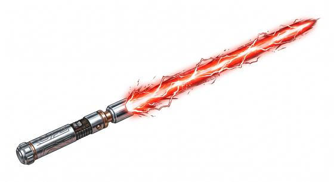

# Plasma Sword

{.illus}

*Set: Expansion*

*aka: ______________________________*

*Era: Spaceflight (needs spaceflight) · Frontier settlers and smugglers*

A hilt that throws out a blade of raw plasma, barely held in shape. Where an energy blade is a clean, steady edge, this is a roaring, spitting thing: the blade flickers, sheds sparks and crackles with little arcs of lightning, and it cuts through plate as if it were cloth. It is cheaper and cruder than an energy blade, built from salvaged parts by frontier smiths, pirates and anyone who wants the power without the price.

It is loud, hot and never entirely under control. A bad swing can make the field flare and scorch the hand that holds it, and a blade left running too long starts to wander. Those who carry one say it is less a sword than a bottled storm, and they respect it the way you respect fire.

## Game block

- **Group:** [Energy Blades](../Weapon_Groups/energy-blades.md) · **Damage:** 2d6+1· **Strength number:** 6
- **Hands:** one or two · **Weight:** 1.2 kg · **Price:** 40 S
- **Notes:** a crackling blade of raw plasma; armour counts half; unstable: on a natural 20 it flares and burns the wielder for 1d6
- **Techniques (from the group):** Burning Parry, Through the Plate

## Not to be confused with

the *[Energy Blade](energy-blade.md)*, a clean, steady and costly blade; the plasma sword hits harder but is crude, unstable and can burn its owner.

