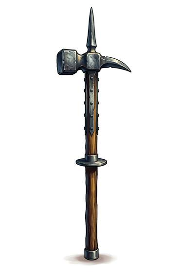

# Poleaxe

{.illus}

*Set: Expansion*

*aka: ______________________________*

*Era: Iron (needs iron) · Western kingdoms · Knightly and common warfare*

A haft taller than a man, topped with an axe blade on one side, a hammer or beak on the other and a long spike on top, often with a smaller spike at the bottom end. It is the weapon of a knight on foot in full plate, fighting other knights in full plate. Tournament champions and royal bodyguards train with it for years.

Each part has its job. The spike thrusts, the axe cuts, the hammer stuns, the beak hooks and pierces. A skilled fighter spins it, levering the haft under an elbow or behind a knee, and trips as often as he strikes. It is a weapon of many tricks and much training, and one that looks crude only to those who have never faced one.

## Game block

- **Group:** [Polearms](../Weapon_Groups/polearms.md) · **Damage:** 2d6· **Strength number:** 13
- **Hands:** two · **Weight:** 2.5 kg · **Price:** 40 S
- **Notes:** axe, hammer and spike on a staff
- **Techniques (from the group):** Unhorse, Second Rank, Hook and Pull

## Not to be confused with

the *[Halberd](halberd.md)*, a similar weapon for massed infantry that has a broader axe and is easier to learn.

