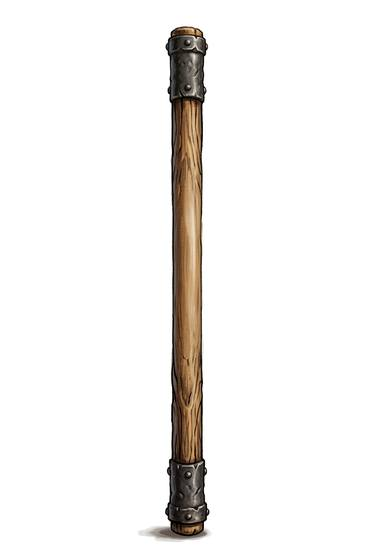

# Quarterstaff

{.illus}

*Set: Core*

*aka: ______________________________*

*Era: Iron (needs iron) · Western kingdoms · Knightly and common warfare*

A stout, straight pole of ash or oak, as tall as a man or a little taller, sometimes shod with iron at the ends. Travellers carry it to lean on, to test the ground and to discourage those they meet on the road. Pilgrims, yeomen, shepherds and apprentices all learn a few moves with one.

It looks humble and is not. Held in both hands with a gap between them, it strikes from either end, sweeps legs, and catches blows on its length. A skilled user can hold a swordsman at bay and knock him down before he can close. It doesn't cut, so it's legal to carry in places where a blade is not, which makes it a favourite of those who expect trouble but can't be seen expecting it.

## Game block

- **Group:** [Staves](../Weapon_Groups/staves.md) · **Damage:** 1d6· **Strength number:** 8
- **Hands:** two · **Weight:** 2 kg · **Price:** 1 S
- **Notes:** a traveller's weapon; +1 Parry
- **Techniques (from the group):** Both Ends, Spinning Guard, Leg Sweep

## Not to be confused with

the *[Baton](baton.md)*, a short, one-handed stick carried by watchmen and police.

