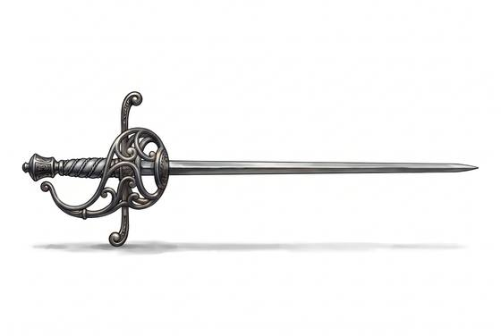

# Rapier

{.illus}

*Set: Expansion*

*aka: ______________________________*

*Era: Gunpowder (needs gunpowder) · Duellists and courts*

A long, slender sword with an elaborate guard of swept bars, rings and cups that wrap the hand. It is a civilian blade, worn with fine clothes rather than armour, and it is made to reach: the point arrives before the other man's does, and a single thrust through the body ends the matter. Fencing masters open schools and write books, and young men learn to fight in geometry.

The edge can cut, but no one who has learned properly relies on it. Everything happens along the line of the blade: feints, disengages, lunges from outside distance. It is a poor weapon on a battlefield and a superb one in an alley or a courtyard at dawn. Often it is worn with a dagger in the other hand.

## Game block

- **Group:** [Fencing Blades](../Weapon_Groups/fencing-blades.md) · **Damage:** 1d6+1· **Strength number:** 8
- **Hands:** one · **Weight:** 1.2 kg · **Price:** 10 G
- **Notes:** long reach; the point is everything
- **Techniques (from the group):** Lunge, Feint in Time, Riposte

## Not to be confused with

the *[Smallsword](smallsword.md)*, a later, shorter and lighter court sword built only for the thrust.

