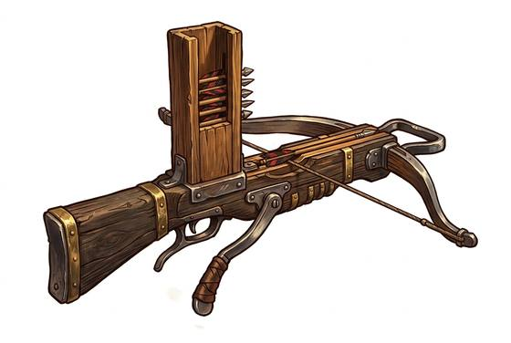

# Repeating Crossbow

{.illus}

*Set: Expansion*

*aka: ______________________________*

*Era: Iron (needs iron) · Eastern empire · Imperial armies*

A crossbow with a box of bolts mounted on top of the stock, worked by a single lever. Pull the lever back and a bolt drops into place and the string is drawn; push it forward and the bolt flies. A trained soldier can empty the box in the time it would take to load a single ordinary crossbow.

The price of speed is power. Its bolts are light and short, the bow is weak, and it barely scratches armour. So the bolts are often dipped in poison, and it is used in great numbers to defend walls and gateways, spraying anyone who comes close. Even peasants can be taught to use it, which is exactly why the imperial armies like it.

## Game block

- **Group:** [Crossbows](../Weapon_Groups/crossbows.md) · **Damage:** 1d6+1· **Strength number:** 7
- **Hands:** two · **Range (m):** 5/15/30/50/80 · **Reload:** every round, 10 bolts · **Weight:** 3 kg · **Price:** 50 S
- **Notes:** fast and weak; the bolts are often poisoned
- **Techniques (from the group):** Held at the Ready, Quick Span

## Not to be confused with

the *[Light Crossbow](light-crossbow.md)*, which shoots one heavier bolt at a time and must be reloaded by hand after each shot.

