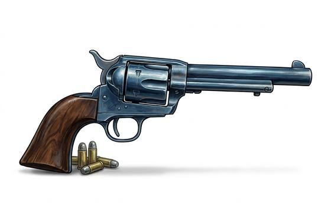

# Revolver

{.illus}

*Set: Core*

*aka: ______________________________*

*Era: Steam (needs steam) · Frontier and industrial nations*

A handgun with a rotating cylinder of chambers behind a single barrel. Cock the hammer and the cylinder turns, bringing a fresh load in line; pull the trigger and it fires, again and again, until the chambers are empty. For the first time a man can carry several shots on his hip, and the frontier changes because of it.

The revolver is loaded one chamber at a time, which is slow in a hurry, and many carry two for that reason. It is a weapon of short distances: across a bar, down a street, from horse to horse. Lawmen, outlaws, officers, gamblers and settlers all own one, and all speak about it as if it were a person. The good ones last a lifetime.

## Game block

- **Group:** [Handguns](../Weapon_Groups/handguns.md) · **Damage:** 1d6+1· **Strength number:** 7
- **Hands:** one · **Range (m):** 5/15/30/50/100 · **Reload:** 6 shots, 2 rounds · **Weight:** 1.2 kg · **Price:** 10 S
- **Techniques (from the group):** Quick Draw, Two-Gun Fire, Fan the Hammer

## Not to be confused with

the *[Semi-Automatic Pistol](semi-automatic-pistol.md)*, which feeds from a quick-changing box magazine instead of a cylinder that must be loaded by hand.

