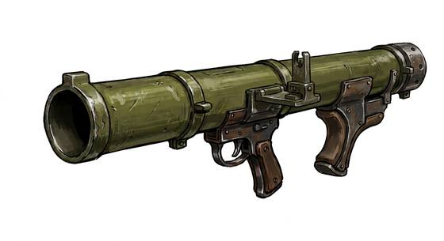

# Rocket Launcher

{.illus}

*Set: Expansion*

*aka: ______________________________*

*Era: Electricity (needs electricity) · Modern armies and police*

A tube carried on the shoulder that fires a finned rocket with a shaped explosive warhead. It is meant for tanks, armoured cars and bunkers, things that no rifle can hurt. The operator kneels, checks that nobody is behind them, sights and fires, and the backblast throws a cloud of dust and flame out of the rear of the tube.

It carries one shot at a time and reloading is slow, often done by a second soldier. The launch gives away the firer's position instantly. It turns infantry from helpless prey into a real danger to armour, and ruined vehicles along roads and in town squares are its mark. In an enclosed room, the backblast is as dangerous as the rocket.

## Game block

- **Group:** [Heavy Weapons & Launchers](../Weapon_Groups/heavy-weapons-and-launchers.md) · **Damage:** 4d6 within 2 paces, 2d6 within 5, nothing beyond· **Strength number:** 11
- **Hands:** two · **Range (m):** 10/50/150/300/500 · **Reload:** 1 shot, 2 rounds · **Weight:** 7 kg · **Price:** 20 S
- **Notes:** made for vehicles and bunkers
- **Techniques (from the group):** Set the Gun, Leading the Target

## Not to be confused with

the *[Field Cannon](field-cannon.md)*, a crewed gun on wheels that fires far more often but can't be carried by one soldier.

