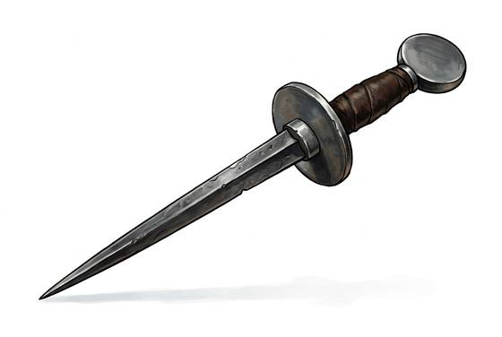

# Rondel Dagger

{.illus}

*Set: Expansion*

*aka: ______________________________*

*Era: Iron (needs iron) · Western kingdoms · Knightly and common warfare*

A long, stiff, narrow blade, often square or triangular in section, with a disc of metal at each end of the grip. It has almost no edge worth mentioning. It is a spike, made for one purpose: to find a gap in armour and go through it.

Knights carry it at the right hip, and it comes out when the fight goes to the ground. With one hand pinning the enemy and the other gripping the dagger point-down, the rondel goes into the visor slit, the armpit or the joint behind the knee. It is a cruel, close weapon, and more than one champion who survived lance, sword and axe died to one in the mud.

## Game block

- **Group:** [Knives & Daggers](../Weapon_Groups/knives-and-daggers.md) · **Damage:** 1d4· **Strength number:** 6
- **Hands:** one · **Weight:** 0.4 kg · **Price:** 8 S
- **Notes:** a spike for the gaps in plate
- **Techniques (from the group):** Inside the Guard, Through the Gap, Concealed Draw

## Not to be confused with

the *[Parrying Dagger](parrying-dagger.md)*, a later fencer's blade held in the off hand to turn aside a sword.

